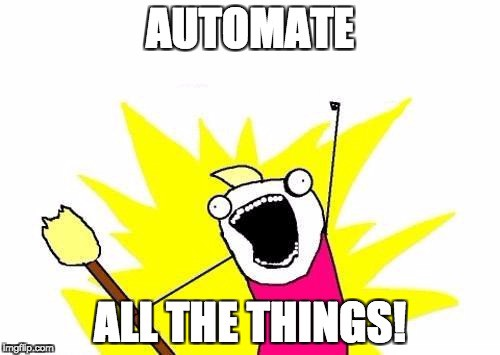

```{r,setup, include=FALSE}
knitr::opts_chunk$set(cache=TRUE)
```

# Planejamento Estratégico CGE

* Desenvolvimento de serviço/aplicativo para automação da carga de dados no Portal de Dados Abertos

Um processo de extração, transformação e carga (ETL) robusto é fundamental para uma iniciativa de dados abertos. ETL é [_como_](http://daguar.github.io/2014/03/17/etl-for-america/) você faz abertura de dados.

Além de ser realizado de forma automática, ele deve possuir mecanismo de visibilidade e notificação do status de cada carga, indicando o sucesso ou apontando problemas em sua execução.

# Planejamento Estratégico

* Condução de avaliações de qualidade dos dados publicados via modelos de maturidade de publicação de dados abertos

A automação da carga da dados no Portal de Dados Abertos é condição necessária, mas não suficiente, para garantir o sucesso das iniciativas de dados abertos. Do lado da [oferta de dados abertos](http://opendatatoolkit.worldbank.org/en/supply.html), a condução de avaliações pela equipe da DTA/CGE que visem apontar falhas de qualidade nos dados já publicados ou que serão no futuro é importante para indicar quais correções devem ser realizadas.

# Projeto dadosmg

Principais subprojetos:

1. Definição de um modelo padrão de metadados para descrição dos conjuntos de dados do Portal de Dados Abertos (DTA).
2. Desenvolvimento de fluxo ETL para publicação das bases de dados do Portal da Transparência
    * ET: NUCC, T: DTA, L: DTI;
3. Implantação e hospedagem do CKAN (DTI);

Além disso, em termos de processo de trabalho, vamos, na medida do possível, utilizar práticas de desenvolvimento aberto (working in the open).

Prazo para entrada em produção: 17/julho

# ()



# Modelo padrão de metadados

* Utilização das [especificações](https://specs.frictionlessdata.io/) produzidas pelo projeto [Frictionless Data](https://frictionlessdata.io/), em especial as especificações [Tabular Data Package
](https://specs.frictionlessdata.io/tabular-data-package), [Table Schema](https://specs.frictionlessdata.io/table-schema/) e [CSV Dialect](https://specs.frictionlessdata.io/csv-dialect/) para descrição dos conjuntos de dados do Portal da Transparência

* Exemplo: [transparencia-mg/letters-datapackage](https://github.com/transparencia-mg/letters-datapackage)

# Fluxo ETL Portal da Transparência

* Para cada conjunto de dados vamos produzir um repositório no Github que armazena os metadados do data.package

# Implantação CKAN

* Utilização de serviço para validação da qualidade dos metadados dos conjuntos inseridos no CKAN com mecanismo de visibilidade
  * Exemplo: [CKAN extension for validating Data Packages using Table Schema](https://github.com/frictionlessdata/ckanext-validation)

* Documentação da infraestrutura e etapas utilizadas para implantação (deploy) do CKAN
  * Exemplo: https://ckan.org/deployment-survey/

# Desenvolvimento aberto

* Organização https://github.com/dadosmg centraliza documentação, código, apresentações, discussões, demandas do projeto
  * Incluindo etapas de ETL realizadas no Informatica PowerCenter :)

* Para dúvidas, utilize o canal [#dados-abertos](http://chat.cge.mg.gov.br/channel/dados-abertos) no chat da CGE.
