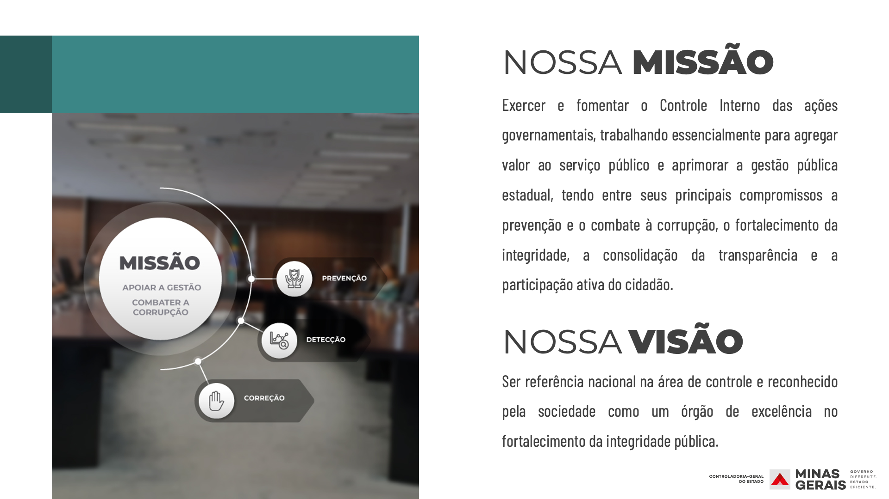
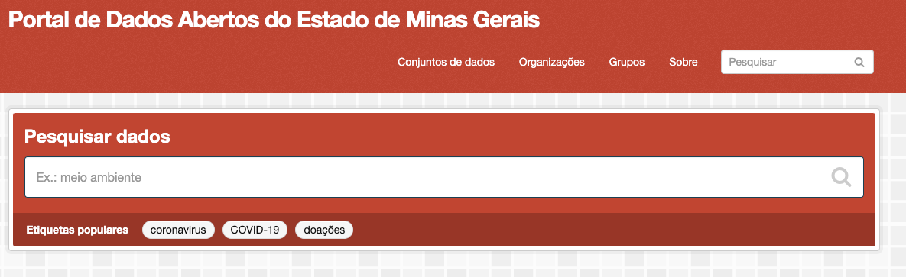
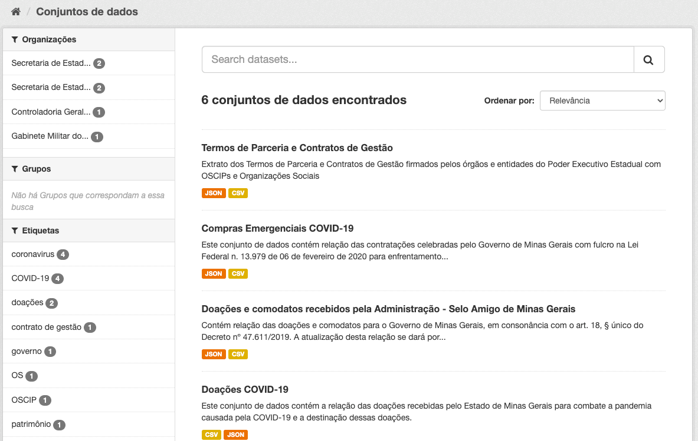
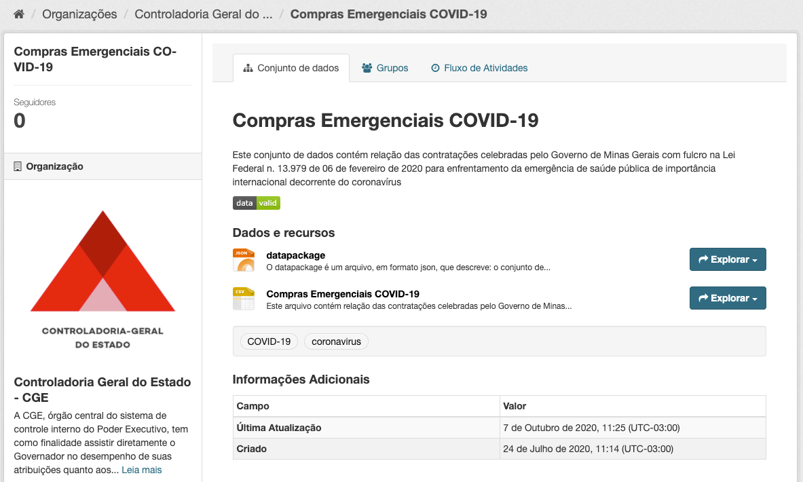
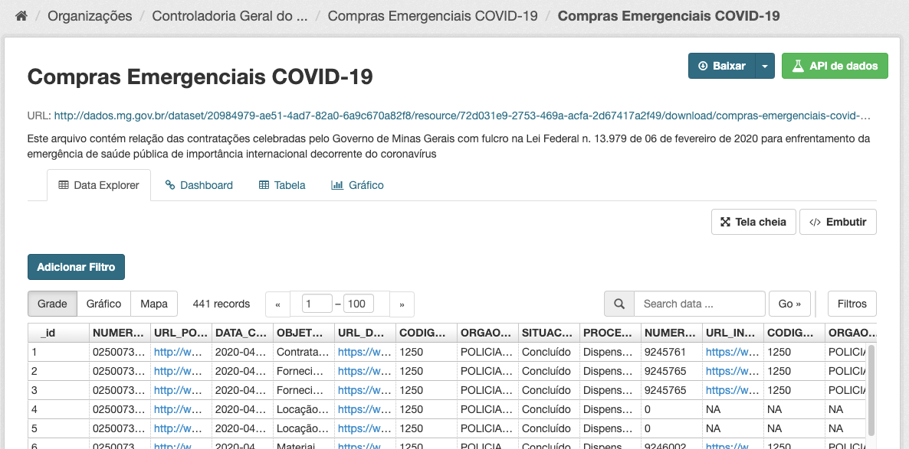
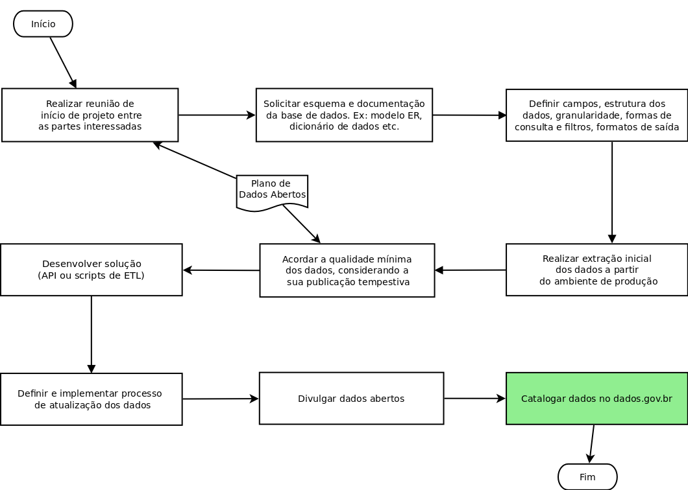
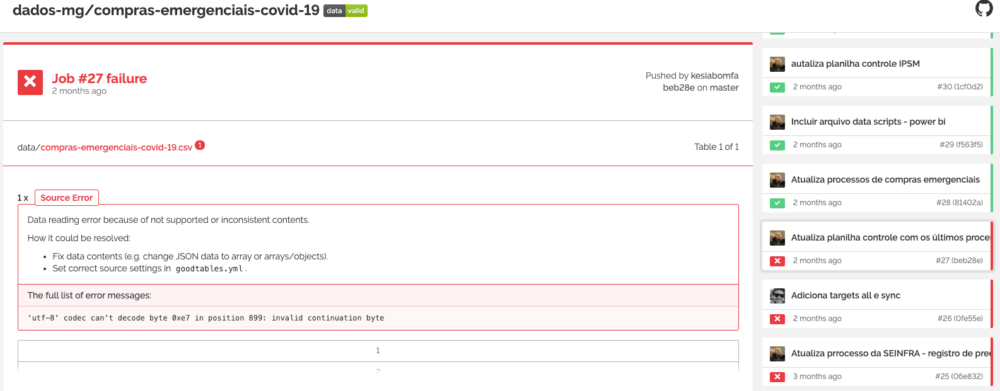

background-image: url("static/capa-slide-template-cge_1920.png")
background-size: cover

---

```{r, echo=FALSE, out.width="150%"}

```
---

# Agenda

- Contexto
  - O que são dados abertos?
  - O que é um portal de dados abertos?
- Histórico e experiências
- Problemas e soluções
- Projeto dadosmg
- Próximos Passos

???

- Nossos objetivos para as parcerias com os gestores custodiantes de dados são: 
    - apresentar o PdA e quais problemas ele visa atacar
    - apresentar o processo de publicação
    - convidar para um projeto piloto de abertura de dados
    - obter feedback sobre o processo de publicação

- Nosso objetivo pra hoje é apresentar uma visão geral do PdA e do processo de publicação, ouvir as suas motivações e, especialmente, os tipos de problemas de dados (dores), mesmo que não estejam relacionados ao que a gente apresentou, e por fim conversar sobre o convite e próximos passos.

- O feedback é claro a gente espera durante a execução do projeto piloto

- [INSERIR QUE TIPO DE FEEDBACK ESPERAMOS RECEBER COMO NO GUIA DE TRANSPARENCIA ATIVA. EXEMPLOS: APRESENTACAO INICIAL; FERRAMENTAS E TECNOLOGIAS; ETC]{.todo}

- Ressalva antes de continuarmos é que estamos em pré-alfa

- Sumário Projeto dadosmg
  - O processo de abertura de dados
  - Padrão de metadados
  - Abertura dos dados do Portal da Transparência
  - Desenvolvimento aberto

---

# O que são dados abertos?

> __Dados Abertos<sup>1</sup>:__ dados públicos (1) representados em meio digital (2), estruturados em formato aberto (3), processáveis por máquina (4) e referenciados na rede mundial de computadores (5), disponibilizados sob licença aberta (6) que permita sua livre reutilização, consumo ou cruzamento em aplicações digitais desenvolvidas pela sociedade.

O objetivo, que constitui dever dos órgãos e entidades públicas por força da [Lei de Acesso à Informação](http://www.planalto.gov.br/ccivil_03/_ato2011-2014/2011/lei/l12527.htm#art8%C2%A73), é a divulgação de dados "de modo a facilitar a análise das informações", incluindo "detalhes [d]os formatos utilizados para estruturação da informação".

.footnote[
[1] [Resolução CGE 20/2014](http://pesquisalegislativa.mg.gov.br/LegislacaoCompleta.aspx?cod=171158)
]

---
# O que são dados abertos?

> Art. 8º É dever dos órgãos e entidades públicas promover, independentemente de requerimentos, a divulgação em local de fácil acesso, no âmbito de suas competências, de informações de interesse coletivo ou geral por eles produzidas ou custodiadas.
> 
> [...]
> 
> § 2º Para cumprimento do disposto no caput, os órgãos e entidades públicas deverão utilizar todos os meios e instrumentos legítimos de que dispuserem, sendo obrigatória a divulgação em sítios oficiais da rede mundial de computadores (internet).

.footnote[
-- [Lei nº 12.527/2011](http://www.planalto.gov.br/ccivil_03/_ato2011-2014/2011/lei/l12527.htm#art8)
]

---
# O que são dados abertos?

> § 3º Os sítios de que trata o § 2º deverão, na forma de regulamento, atender, entre outros, aos seguintes requisitos:
> 
> I - conter ferramenta de pesquisa de conteúdo que permita o acesso à informação de forma objetiva, transparente, clara e em linguagem de fácil compreensão;
> 
> II - possibilitar a gravação de relatórios em diversos formatos eletrônicos, inclusive abertos e não proprietários, tais como planilhas e texto, de modo a facilitar a análise das informações;
> 
> III - possibilitar o acesso automatizado por sistemas externos em formatos abertos, estruturados e legíveis por máquina;
> 
> IV - divulgar em detalhes os formatos utilizados para estruturação da informação;
> 
> V - garantir a autenticidade e a integridade das informações disponíveis para acesso;
> 
> VI - manter atualizadas as informações disponíveis para acesso;

---

# O que são dados abertos? 3,5 das [5 estrelas](https://5stardata.info/pt-BR/)

.pull-left[

]
.pull-right[
★ : dados disponíveis na web (não importa o formato) sob uma licença aberta. Por exemplo, um PDF.

★ ★ : dados disponíveis de forma estruturada. Por exemplo, excel no lugar de imagem escaneada.

★ ★ ★ : dados disponíveis em formatos não-proprietários. Por exemplo, um CSV e não excel.

]

> Now in 2010, people have been pressing me, for governmet data, to add a new requirement, and that is there should be metadata about the data itself, and that that metadata should be availble from a major catalog. 

.footnote[
-- [Tim Berners-Lee](https://www.w3.org/DesignIssues/LinkedData.html)
]

---

# O que é um portal de dados abertos?

> __Portal:__ site na internet projetado para aglomerar e distribuir conteúdos de várias fontes diferentes de maneira uniforme, sendo um ponto de acesso para [conteúdos de] uma série de outros sites.

.footnote[
-- [Wikipedia](https://pt.wikipedia.org/wiki/Portal_(internet%29)
]


???

- A natureza do problema solucionado pelo PdA é a mesma do que outros portais na internet, qual seja, servir como ponto de referência para busca e acesso de alguma coisa

- No nosso caso, busca e acesso a conjunto de dados. Um conjunto de dados é uma abstração pra representar uma coleção de dados relacionados. Se estamos falando de dados tabulares, um conjunto de dados seria a pasta de trabalho do Excel com possivelmente múltiplas abas.

- Um outro nome pra um "ponto de referência para busca e acesso de alguma coisa" é um catálogo (ie. lista).

- O PdA é um catálogo (_one-stop shop_) para centralização da divulgação de conjuntos de dados. 

- Aqui podemos ver algumas imagens do nosso PdA e das propostas de valor que ele traz de fábrica

---
# dados.mg.gov.br

```{r, echo=FALSE}

```

.footnote[
http://dados.mg.gov.br/
]

???

- 1) consolidação

---
# dados.mg.gov.br

```{r, echo=FALSE, out.width='85%'}

```

.footnote[
http://dados.mg.gov.br/dataset
]

???

- interface de busca otimizada

---
# dados.mg.gov.br

```{r, echo=FALSE, out.width='85%'}

```


.footnote[
http://dados.mg.gov.br/dataset/compras-emergenciais-covid-19
]

???

- links para conjuntos de dados

---
# dados.mg.gov.br

```{r, echo=FALSE, out.width='85%'}

```

.footnote[
http://dados.mg.gov.br/dataset/compras-emergenciais-covid-19/resource/72d031e9-2753-469a-acfa-2d67417a2f49
]

???

- links para recursos

---
# Outros portais de dados abertos


- Brasil: https://github.com/dadosgovbr/

- Estados Unidos: https://github.com/GSA/data.gov/

- Reino Unido: https://github.com/alphagov?q=data

- França: https://github.com/etalab/data.gouv.fr

- Itália: https://github.com/italia/?q=data

- Austrália: https://github.com/datagovau

- Buenos Aires: https://github.com/datosgcba/

???

- A quarta proposta de valor que também é de fábrica vem do simples fato de ser uma plataforma, o que significa que existem economias de escala no oferecimento de novas funcionalidades que sejam demandadas (eg. integração com fala.BR/Fale Conosco; fórum de discussão; preview dos dados etc)

- [ALTERACAO ESCOPO DO PdA DE GESTAO DE FINANCAS PUBLICAS]{.todo}

- [TODO MUNDO TEM, FAZ SENTIDO TER, MAS NAO TEM NADA DE NOVO]{.todo}

---
# Histórico e experiências

- [Resolução CGE 20, de 06/08/2014](http://pesquisalegislativa.mg.gov.br/LegislacaoCompleta.aspx?cod=171158) - Estabelece conceitos e diretrizes, no âmbito da Administração direta, autárquica e fundacional do Poder Executivo Estadual, em matéria de dados abertos governamentais.

  Estabelece que os critérios e procedimentos necessários para abertura dos dados governamentais pelos demais órgãos e entidades serão definidos pela Subcontroladoria da Informação Institucional e da Transparência, em conjunto com o Comitê Executivo de Tecnologia da Informação e Comunicação.

- [Resolução Conjunta SEPLAG/CGE 9881, de 24/07/2018](http://pesquisalegislativa.mg.gov.br/LegislacaoCompleta.aspx?cod=183657) - Dispõe sobre a atuação conjunta para o fortalecimento do ambiente de integridade no âmbito da Administração Pública estadual. 

    Um dos objetivos constantes do plano de ação é "Instituir marco normativo para a abertura de dados no âmbito dos órgãos e entidades da Administração Pública estadual"

???

- Fato: Recebemos duas demandas de atualizar as bases de dados do Portal da Transparência no Portal de Dados Abertos para subsidiar os eventos de Hackathon da Feira Finity em 2016 e do Movimento Amplifique em 2017.
- Ação: A PRODEMGE extraiu as bases completas dos anos de 2015 e 2016 e a DTA fez o upload delas no Portal de Dados Abertos (manualmente). Em 2017, ocorreu nova atualização com dados de janeiro a julho/17 com o custo de 7.133,00, pago à PRODEMGE
- Consequências: O Portal de Dados abertos está incompleto e desatualizado - não possui dados de 2002 a 2014 e nem a partir de agosto de 2017, exceto as bases da remuneração. As consultas disponibilizadas após agosto de 2017 não possuem nenhum dado disponível no Portal de Dados abertos
- Descrição da lição aprendida: A extração automática das bases de dados deveria ter acompanhado todo o processo de construção do Portal, tendo sido previsto desde o início, assim como o serviço de hospedagem. Para 2019, o ideal é conseguir recursos para desenvolver uma aplicação que extrai automaticamente todas as bases do Portal da Transparência e disponibiliza no Portal de Dados Abertos.

- No geral ficou a desejar em razão de falta de capacidade em gestão de dados enquanto disciplina que implica em uma dificuldade de publicar dados que por lei deveriam estar sendo publicados, especialmente automação e qualidade

---
# Problemas e soluções - Automação

### [Planejamento Estratégico da CGE 2020-2023](http://www.cge.mg.gov.br/noticias-artigos/701-cge-minas-divulga-planejamento-estrategico-para-os-proximos-3-anos)

__Ação:__ Desenvolvimento de serviço/aplicativo para automação da carga de dados no Portal de Dados Abertos

__Indicador:__ Percentual das consultas do Portal da Transparência divulgadas no Portal de Dados Abertos de maneira tempestiva

???

- Automação é uma responsabilidade essencialmente do custodiante/publicador de dados. A nossa responsabilidade enquanto administrador do PdA é garantir que exista um processo de catalogação que seja automatizável

- Podemos conversar, mas hoje, seria basicamente pra compartilhar as nossas dificuldades

---
# Problemas e soluções - Qualidade

- Upload de arquivos incorretos

- Alteração nos nomes das colunas

- Alteração na ordem das colunas

- Alteração nos cabeçalhos das colunas

- Alteração no formato dos arquivos (csv -> xslx -> csv)

- Alteração de leiautes sem comunicação

- Documentação não disponibilizada em formato estruturado

- Documentação não disponibilizada junto com os dados 

- Documentação inexistente para dados de referência (códigos, descrições e interpretações e domínio das colunas)

---
# Problemas e soluções - Qualidade

Algumas definições<sup>1</sup>

.footnote[
[1] Tradução e adaptação da [ISO 9000](https://en.wikipedia.org/wiki/ISO_9000)
]

> __qualidade:__ grau em que um conjunto de características inerentes de um objeto  atende a especificação

--

<br>

> __qualidade:__ grau em que um conjunto de características inerentes [ie. metadados] de um objeto [ie. dados] atende a especificação [ie. padrão]

--

<br>

A aferição da qualidade também deve ser um processo automatizado.

--

Solução: Adoção de um padrão para documentação dos dados que permita uma verificação/validação automatizável se os dados estão em conformidade com o especificado

???

- Do ponto de vista de qualidade o nosso papel enquanto administrador é maior, pois, enquanto gestores da plataforma, podemos fazer [moderação de conteúdo][20201016T180948], ou seja, estabelecer as regras e diretrizes sobre qual conteúdo pode ser publicado. As regras impactam diretamente na qualidade do conteúdo publicado

- Solução - Parte 2: Catalogação automatizada no PdA de conjuntos de dados publicados pelos órgãos e entidades que foram documentados de acordo com o padrão de metadados escolhido

---
# Padronização

.center[
```{r, echo=FALSE, out.width='85%'}
knitr::include_graphics("https://imgs.xkcd.com/comics/standards.png")
```
]

---
# O processo de abertura de dados

```{r, echo=FALSE, out.width='85%'}

```

.footnote[
-- [Kit para dados abertos](https://kit.dados.gov.br/Abertura-de-dados/)
]

???

- O objetivo do [projeto piloto](https://github.com/dadosgovbr/kit/blob/master/Piloto-%C3%A1gil.md) foram bem sumarizados no [Kit para dados abertos](https://kit.dados.gov.br/) do Governo Federal, quais sejam:
    - Ter, em curto prazo, um resultado prático de abertura de dados à disposição da sociedade
    - Preparar as equipes técnicas da instituição, familiarizando-as com os conceitos, terminologias, métodos e ferramentas necessários ao processo de abertura de dados
    - Iniciar o preparo da infraestrutura tecnológica de suporte aos dados abertos na instituição
    - Colher das lições aprendidas no projeto de piloto ágil as necessidades para os futuros projetos de abertura de dados, tais como capacitação de pessoal, aquisição de infraestrutura, etc.

---
# O processo de abertura de dados - Exemplo data.gov

1. Federal agencies are required publish an enterprise data inventory, provided as a `data.json` file

2. Using the standard [Project Open Data metadata schema](https://resources.data.gov/resources/dcat-us/)

3. On the agency’s website at `agency.gov/data.json`

4. Data.gov team creates a new Data.gov harvest source for the `data.json`

5. The `data.json` file gets harvested to the Data.gov catalog


.footnote[
-- [How to get your Open Data on Data.gov](https://resources.data.gov/resources/data-gov-open-data-howto/)
]
---
# Projeto dadosmg - Padrão de metadados

```json
{
  "fields": [
    {
      "name": "name of field (e.g. column name)",
      "title": "A nicer human readable label",
      "type": "A string specifying the type",
      "format": "A string specifying a format",
      "description": "A description for the field"
      ...
    },
    ... more field descriptors
  ],
  // (optional) specification of missing values
  "missingValues": [ ... ],
  // (optional) specification of the primary key
  "primaryKey": ...
  // (optional) specification of the foreign keys
}
```

-- [Frictionless Data Specs](https://specs.frictionlessdata.io/)

???

- Padrão de metadados é um template do excel bombado

---
# Projeto dadosmg - Validação

```{r, echo=FALSE}

```

- [Github](https://github.com/dados-mg/compras-emergenciais-covid-19)
- [CKAN](http://dados.mg.gov.br/dataset/compras-emergenciais-covid-19)


---
# Projeto dadosmg - Desenvolvimento aberto

- Desenvolvimento: Template de projeto padrão + Gestão de tickets + Controle de versão

- Aberto: Indivíduo | Equipe | Organização | Estado | Sociedade

???

- Adotar práticas e fluxos de trabalho da engenharia de software para fins de criação dos data packages

- Fazer isso de forma aberta e colaborativa

- Criação de capacidade nas equipes de dados dos órgãos e entidades

---
# Próximos passos

### Equipe gerencial

- Seleção de conjunto(s) de dados para abertura
- Indicação de equipe do projeto e ponto focal
- Deliberação sobre adoção de desenvolvimento aberto

### Equipe técnica

- Leitura dos guias:
  - [Introdução ao Frictionless Data](https://frictionlessdata.io/guide/)
  - [Introdução ao Table Schema](https://frictionlessdata.io/table-schema/)
  - [Introdução ao Data Package](https://frictionlessdata.io/data-package/)
  - [Especificações](https://specs.frictionlessdata.io/)
- Assistir:
  - [Data Package Creator walkthrough](https://www.youtube.com/watch?v=VrdPj28-L9g)
  - [Frictionless Data Fellows Workshop](https://www.youtube.com/watch?v=EFQmudQP4io)
- Explorar ecossistema de ferramentas do [Frictionless Data](https://frictionlessdata.io/)
- Participar das [discussões](https://github.com/dados-mg/issues/issues) do Projeto dadosmg

---
# Outras oportunidades

- Desenvolvimento de um fluxo de dados (ETL / data pipeline) para processamento e publicação dos conjuntos de dados geridos de forma centralizada pela equipe do Portal de Dados Abertos
- Planejamento de pesquisa com usuários para levantamento e validação das funcionalidades do Portal de Dados Abertos para elaboração de roadmap
- Concepção e desenvolvimento de um fluxo de dados (harvesting) para publicação dos conjuntos de dados geridos de forma descentralizada pelos órgãos e entidades do Estado de Minas Gerais
- Sugestões de melhoria ao padrão de metadados (Frictionless Data) selecionado para documentação dos conjuntos de dados do Portal de Dados Abertos
- Concepção de identidade visual e desenvolvimento de tema no CKAN para customização do Portal de Dados Abertos

.footnote[
-- [Portifólio de Projetos de Controle Social, Integridade e Transparência](https://gist.github.com/fjuniorr/36abc1cd5988246c72dc62f175cdee21#file-portal-dados-abertos-md)
]